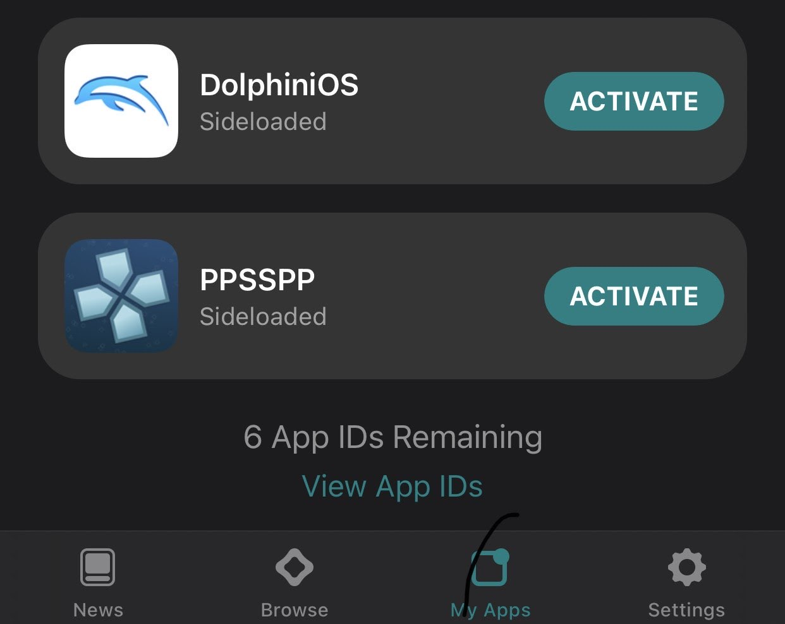
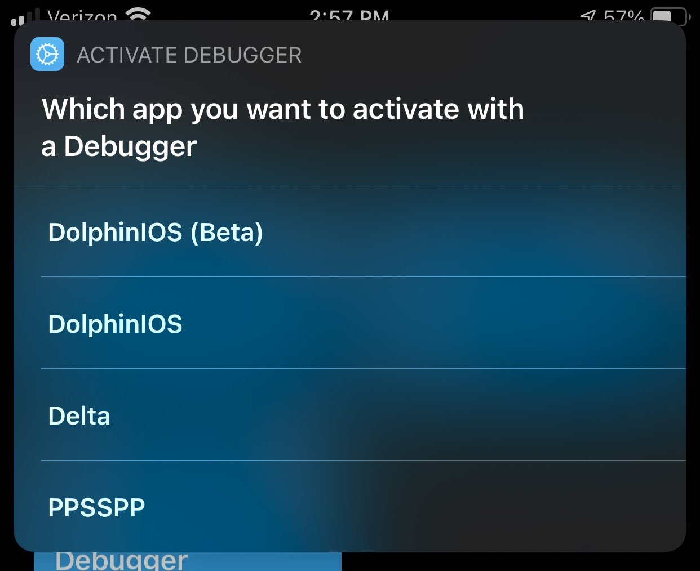
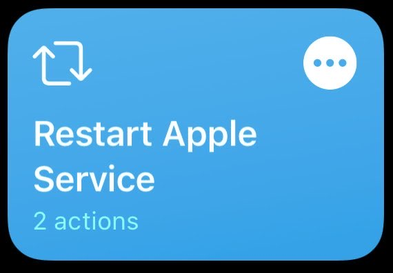
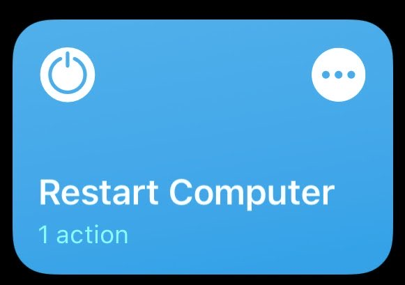

# **_Instructions for how to run DolphiniOS from Windows,Mac OS,Linux (Debian) tethered. _**

_By Jkcoxson and Spidy123222_

notice: If you want to add anything like a ssh shortcut or something talk to us in Oatmealdome's home discord <https://discord.gg/rdx6Bt8>

Google Docs <https://docs.google.com/document/d/11_jju27qzhH_epq9XS1SlIlaBDPfvekRRYs5NS_ze_U/edit>

## _Required Knowledge_

Before starting you will need some terminology and information before starting. For the moment the only Windows install method requires DMG files which hold the debugger needed to activate JIT (just in time).

This tutorial works on other apps other than DolphiniOS, like PPSSPP and UTM. The tutorial gets revised over time and some might even fix some install issues.

Got a lot of results from people trying it out and concluded that you might have to remount the debug image if your device dies or restarts. Which isn't a big deal if you have a shortcut or mount it when you start the debugger.

Please make it easier for yourself and have a notepad or a text editor to put the commands in first that you will need to edit and reuse.

### Terminology

- **UDID:** Unique Device Identification is used for identifying your specific device and never changes out of manufacturer.

- **BundleID/PackageID:** This Identification is for applications and is unique for each app

### Finding BundleID via Altstore

This requires having Altstore installed (Windows and Mac only) but once it’s installed make sure to install the app you want first.

- First go to **My Apps** and scroll down to **View App IDs**

- In there you will see a unique bundle under the app's name. Make sure to write it down. Note, it is case sensitive.

## _Windows_

1. Download iTunes from Apple's website (not the Windows Store)

2. Download libimobiledevice from [https://github.com/libimobiledevice-win32/imobiledevice-net/releases/](https://github.com/libimobiledevice-win32/imobiledevice-net/releases/)

3. Plug in your iDevice for now (this will work over WiFi later).

4. Open iTunes, click on your device and make sure you trust this computer on your iDevice. It will ask you for a passcode.

5. Scroll down and check the box for WiFi sync in iTunes.

6. Minimize iTunes and open a power shell and Type.

`"cd \Users\yourusername\**_LocationOfFile_**\libimobiledevice.1.2.1-r1122-win-x64" `

but fill in the correct information pertaining to where you saved and unzipped Libimobiledevice on your computer

7. Run ` .\idevice_id.exe ` and copy the numbers and/or letters it gives you this is the UDID.

8. Open AltStore, press My Apps and then view App IDs. Write down the small letters of DolphiniOS, as shown in the prerequisites from above.

9. Then, you will need to download the Developer Disk Image from either of these links. If your dmg isn’t in one try the other. Note, you must download the version that is the same as your major iOS release. For example, a device running 14.4.2 will download 14.4.

    Download1: [https://github.com/mspvirajpatel/Xcode_Developer_Disk_Images/releases/](https://github.com/mspvirajpatel/Xcode_Developer_Disk_Images/releases/)

    Download2: [https://github.com/pdso/DeveloperDiskImage/tree/master](https://github.com/pdso/DeveloperDiskImage/tree/master)

10. Unzip it and type 

` .\ideviceimagemounter.exe \Users\username\LocationOfFile\iosversionofFile\DeveloperDiskImage.dmg 
`

If it fails to mount, restart both your iDevice and PC.

11. Then you can finally make sure you can run the app by running  

` .\idevicedebug -u UDID -n --detach run PackageID `

where you replace UDID and PackageID with their values you found before.

	 

- **_Important note:_** On step 11 _there is a space in between `-n` and `--detach`_. Also you can remove `-n` if you are wanting to activate through usb only. `-n` is for network.

- **_Recommendation:_** To prevent mess ups on step 11 copy the command and paste it in notepad or a text editor and add UDID and packageID and run the command you edited.

## _MacOS install_

1. Download [https://GitHub.com/jkcoxson/DiOS-instructions](https://GitHub.com/jkcoxson/DiOS-instructions)

2. Move the two idevice files to 

` /usr/local/bin `

3. Move the dylib to 
` /usr/local/lib `

4. In terminal enter 

` chmod +x /usr/local/bin/idev* `

5. Make sure your device is plugged in and that it is Trusted. Then go in Finder and click your device and Enable WiFi sync.

6. Type in and enter 

` idevice_id `

7. It should of returned your UDID of you’re device

8. Type without []  

` idevicedebug -u [UDID] -n --detach run [BundleID] `

- **_Important note:_** on step 8 _There is a space in between `-n` and `--detach`. _ Also you can remove `-n` if you are wanting to activate through usb only. `-n` is for network.

- **_Recommendation:_** to prevent mess ups on step 8 copy the command and paste it in notepad or a text editor and add udid and packageID and run the command you edited.

## _Linux install (Debian)_

1. Download install.sh from github: [https://GitHub.com/jkcoxson/DiOS-instructions](https://GitHub.com/jkcoxson/DiOS-instructions) (still under construction, message jkcoxson any issues you have)

2. Plug iDevice in linux computer and trust computer

3. Go to location of installation
` cd  File/Location `

4. Give file permissions 

` sudo chmod +x ./install.sh `

5. To install just type in 

` sudo ./install.sh `

6. Give login password if needed

7. At the end of install it should give your udid from usb and wifi if you have wifi setup and copy the udid (If your device was not connected or did not show just type in idevice_id to see udid if connected. If you are having trouble with idevice_id responding type the command: sudo service usbmuxd restart )

8. If you are wanting to do over wifi then all you need to do is have the device plugged in and type this command. Idevicepair wifi on

9. Type without []  

` idevicedebug -u [UDID] -n --detach run [PackageID] `

- **_Important note:_** on step 9 _There is a space in between `-n` and `--detach`._ Also you can remove `-n` if you are wanting to activate through usb only. `-n` is for network.

- **_Recommendation:_** to prevent mess ups on step 9 copy the command and paste it in notepad or a text editor and add udid and packageID and run the command you edited.

## _Optional SSH Setup_

The next steps are optional, to make it run from your iDevice. You will need to enable SSH on your PC.

### **_!!Required!!_**

Before you start please keep in mind that you will have to open the firewall for OpenSSH if it’s not allowed through. There are many tutorials on how to allow services or applications to go through the firewall of the computer. Sometimes this is automatic so you may not need to open it for openssh. You will also need to be the admin to set this up which by default most people.

 

You will also need your password and root username so the name your computer uses (On windows it’s called users) Not a Microsoft email.

To find your root username it would be in your main partition for windows so C:/Users/RootUsername

**_Note_**: for some reason if your username and password don’t work you will need to create a SSH key.

### _Windows_

1. Go to settings, apps, apps and features, manage optional features. Then search for OpenSSH server and install it.

You can set up the server to start automatically, open PowerShell in adninistrator type:

` Set-Service sshd -StartupType Automatic  `

 ` Start-Service sshd `

Open and ensure the firewall accept SSH connection, by default port 22, type:

` New-NetFirewallRule -Name sshd -DisplayName 'Allow SSH' -Enabled True -Direction Inbound -Protocol TCP -Action Allow -LocalPort 22 `

To check if the port is listening :

` netstat -a  | findstr 22 `

**_SSH PASSWORD AUTH_**

2. Then, in settings go to the Internet and then look for your IP address. Write that down.

3. On your iDevice, open shortcuts and make a new one. Choose SSH.

4. Put in your IP address, username and password to your computer. Make sure to give the exact location of libimobiledevice, so that includes all the way down to drive letter C:\example\fileloaction\libimobiledevice\idevicedebug. For the command put

 C:Users\username\LocationOfFile\libimobiledevice.1.2.1-r1122-win-x64\idevicedebug -u [UDID] -n --detach run [PackageID]

**_SSH KEY AUTH_** 

2. generating Authorized keys file, Create folder .ssh and navigate to it in powershell:

` md ~/.ssh `

` cd ~/.ssh `

then generate a random key, name it authorized_key and leave blank passphrase(by pressing enter):

` ssh-keygen  `

 Generating public/private rsa key pair.

Enter file in which to save the key (/home/demo/.ssh/id_rsa):` authorized_keys `

Enter passphrase (empty for no passphrase):  ` `

Enter same passphrase again:  ` `

then it will indicate path location of authorized key

3. Add the key of idevice to your Server:

On your idevice :shortcut > scripting > Run Script Over SSH > select Authentification SSH key > press on your key ed25519 or RSA between ur choice > share public key > copy

On Windows : go explorer folder to = C:\Users\Username\.ssh

it should have two files: authorized_keys.pub and authorized_keys
 - authorized_keys.pub delete it (we dont care about this one)
 - authorized_keys Right click go properties>security>group or user names = CHECK if your username is inside this group and got right: Full Control if not add it.

Right click again authorized_keys and edit with notepad, you can erase everything in the file and copy the Pub Key that you got from idevice and save.

4. Activate the PubKey in sshd_config

On Windows : go explorer folder to = C:\ProgramData\ssh 

Edit in notepad sshd_config file: uncomment removing # line 34 and line 85 comment with #

- 34 PubkeyAuthentication yes
- 85 #       AuthorizedKeysFile PROGRAMDATA/ssh/administrators_authorized_keys

Save and restart Openssh server, in powershell :

` Restart-Service sshd `

5. Finish the Shortcut from your idevice filling Host and User info, and write the script following the upper point 4 for SSH PASSWORD AUTH.

### _MacOS_

TO BE DETERMINED

### _Linux_

1. Hecka easy, run sudo apt-get install openssh-server (on systems with apt of course)

2. Choose your method of allowing through iptables. I, jkcoxson, prefer ufw.

3. If you use ufw, run sudo ufw allow 22

4. Put your information and command into the shortcut.

## _Premade shortcuts_

These are shortcuts that are premade by users that help with problems and a premade ssh activation method to select multiple apps.

### _!!Required!!_

- To download just go in shortcuts and make a shortcut with a random action that won’t affect your device then save it and activate it. (Idk why Apple wanted this to be done first before installing untrusted shortcuts)

- Go to settings and enable Allow Untrusted Shortcuts And proceed with downloads 

- You will need to edit the shortcuts to connect to your computer and with your udid and bundleID and file locations. Make sure to go through Optional SSH setup before this

### _Activate Debugger_

This allows debugging apps over ssh with multiple apps and can be useful if you have multiple apps with jit or need a debugger to run.

By: spidy123222

Download: [https://www.icloud.com/shortcuts/246b83074f364e84ba42609b1f71e9d0](https://www.icloud.com/shortcuts/246b83074f364e84ba42609b1f71e9d0)

### _Restart Apple service_

This helps with problems with iTunes on windows not connecting over WiFi.

By: Magnus_Redd

Download: [https://www.icloud.com/shortcuts/50947cc2884a470da132f42d4468c960](https://www.icloud.com/shortcuts/50947cc2884a470da132f42d4468c960)

### _Restart Computer_

This can help with problems with libimobiledevice not attaching a debug image. (This requires auto login to fully work for things like altserver and libimobiledevice).

By: Magnus_Redd

Download: [https://www.icloud.com/shortcuts/7611e9873b2b43fea11c1b459949b339](https://www.icloud.com/shortcuts/7611e9873b2b43fea11c1b459949b339)
